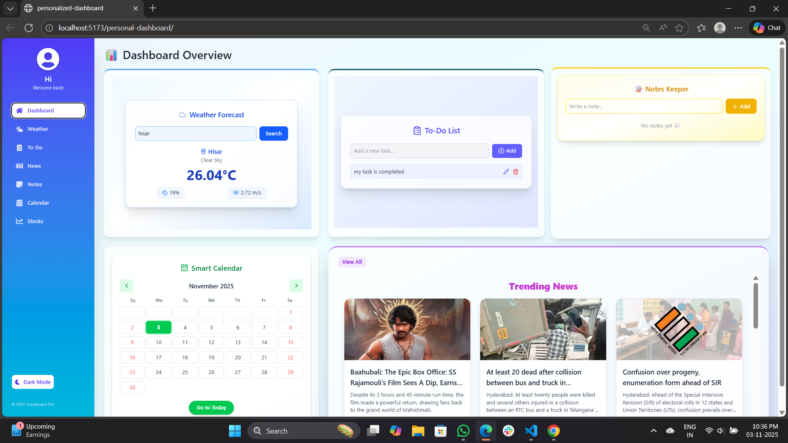

# 🧩 Personalized Dashboard Builder (Drag & Drop Widgets)

A customizable dashboard web app where users can **add, remove, resize, and rearrange** widgets such as Weather, Notes, To-Do List, News Feed, Stocks, and Calendar. The layout is saved automatically in **localStorage**, so users can always return to their personalized setup.

---

## 🚀 Live Demo
🔗 [Your Deployed Link Here](https://muskan-tuteja.github.io/personal-dashboard/)

---

## 🎯 Objective
Build a **drag-and-drop dashboard** that allows users to design their own workspace by selecting and managing widgets.  

## 📸 Screenshots

### 🏠 Dashboard Overview

---

## 🧠 Features
- 🪄 **Add / Remove Widgets** – Choose from Weather, Notes, To-Do, News, Stocks, and Calendar.  
- 🎛️ **Drag & Drop** – Move and resize widgets easily using React Grid Layout.  
- 💾 **Auto Save Layout** – User preferences persist via `localStorage`.  
- 🕹️ **Dark / Light Mode** – Toggle between two clean themes.  
- 🗓️ **Calendar Integration** – View the current month and upcoming events.  
- 📰 **Live News Feed** – Fetch articles from the News API.  
- ☁️ **Weather Widget** – Real-time weather updates from a public API.  
- ✅ **To-Do List** – Add, edit, or delete tasks locally.  
- ✍️ **Notes Widget** – Create sticky notes with auto-save.  
- 🔁 **Reset Layout** – Quickly restore the default view.

---

## 🧰 Tech Stack
- ⚛️ **React.js**
- 🎨 **Tailwind CSS** / Material UI
- 🧩 **React Grid Layout / React DnD**
- 🌦️ **OpenWeather API**
- 📰 **News API**
- 💾 **LocalStorage**

---

